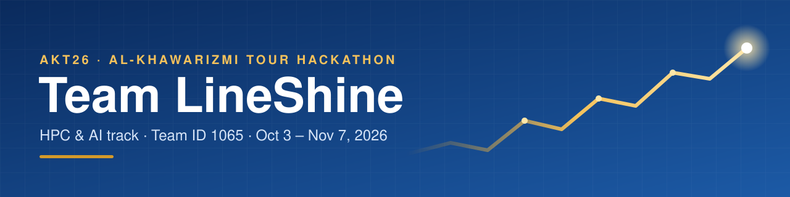

<p align="center">
  
</p>

<p align="center">
  <b>Team LineShine's workspace for the <a href="https://alkhawarizmi-tour.org/">Al-Khawarizmi Tour Hackathon</a> (HPC &amp; AI).</b><br>
  Code, data, finished assignments and the tools we use to organise the team.
</p>

<p align="center">
  <a href="#quick-links">Quick links</a> ·
  <a href="#assignments">Assignments</a> ·
  <a href="#get-started-in-3-steps">Get started</a> ·
  <a href="#whats-in-this-repo">What's in this repo</a> ·
  <a href="#how-we-work">How we work</a>
</p>

---

## The team

**Team ID 1065** · Abdallah Ismail (team leader) · Omar Seifelnasr · Abdulrahman Omran · Anas Elgalad · Mohamed Abd Elaal · Mohamed Salah

## Quick links

| I want to… | Go here |
|---|---|
| See our Week-1 notebook | [notebooks/](notebooks/) |
| Understand Week 1: the task, the requirements, our solution and what it teaches | [docs/assignment-1.md](docs/assignment-1.md) |
| Track tasks, progress and learning | [tracker/](tracker/), in Excel or Notion |
| Learn the topics behind the assignments | [docs/learning-resources.md](docs/learning-resources.md) |
| Read the official brief, slides and notes | [sessions/](sessions/) |
| Open our Notion dashboard | [Notion](https://functional-soapwort-2ac.notion.site/HPC-Competition-3e8ecac9147480f5b17bf11edbfe09c5) |
| Open the course files | [Google Drive](https://drive.google.com/drive/folders/1HY9vywZwunEfJGD7Fqc2uyYcJVlhcVpW?usp=sharing) |
| Submit an assignment (team leader) | [Submission form](https://forms.gle/nW2kwDsy62fJ5KHt5) |

## Assignments

| Week | Assignment | Due (Cairo time) | Status |
|---|---|---|---|
| 1 | **Air-Quality Data Challenge**: clean messy sensor data and build a virtual PM2.5 sensor | Sat, Oct 10 2026, 2:59 PM | Ready to submit |
| 2 | **AI Methods Shoot-out** (uses our cleaned Week-1 data) | announced later | Upcoming |

**Week-1 result:** our cleaning cut the model's error by **5.8%** on the final test year, and all 12 stations improved. [Read how →](docs/assignment-1.md)

## Get started in 3 steps

```bash
pip install uv                                          # 1. install uv (one time)
git clone https://github.com/98-Anas/AKT26-LineShine.git
cd AKT26-LineShine && uv sync                           # 2. install Python + all packages
uv run jupyter lab                                      # 3. open the notebooks
```

`uv sync` gives everyone exactly the same package versions. In VS Code, pick the `.venv` interpreter as the notebook kernel (`.venv/bin/python` on Linux/macOS, `.venv\Scripts\python.exe` on Windows).

## What's in this repo

| Folder | Contents |
|---|---|
| [`notebooks/`](notebooks/) | Assignment notebooks: the files we submit |
| [`docs/`](docs/) | Plain-language write-ups and learning resources |
| [`tracker/`](tracker/) | Project tracker for Excel and Notion, with a reusable template |
| [`sessions/`](sessions/) | Course material from the organisers |
| [`data/raw/`](data/raw/) | The Beijing air-quality dataset (12 station files) |
| [`scripts/`](scripts/) | Scripts that build the notebook and the tracker |
| [`assets/`](assets/) | Images used in this README |
| `pyproject.toml`, `uv.lock` | Python dependencies, managed by uv |

## How we work

1. **Plan:** tasks and daily check-ins live on our [Notion dashboard](https://functional-soapwort-2ac.notion.site/HPC-Competition-3e8ecac9147480f5b17bf11edbfe09c5), or in the [Excel tracker](tracker/).
2. **Build:** `git pull` before you start, then commit and push when you finish. Try ideas in your own notebook first, so we don't overwrite each other.
3. **Submit:** run the notebook top to bottom until it prints `✓ ready to submit`. The team leader then uploads it through the [form](https://forms.gle/nW2kwDsy62fJ5KHt5) with Team ID **1065**.

---

<p align="center"><sub>Al-Khawarizmi Tour · Online Hackathon HPC &amp; AI · Oct 3 – Nov 7, 2026</sub></p>
